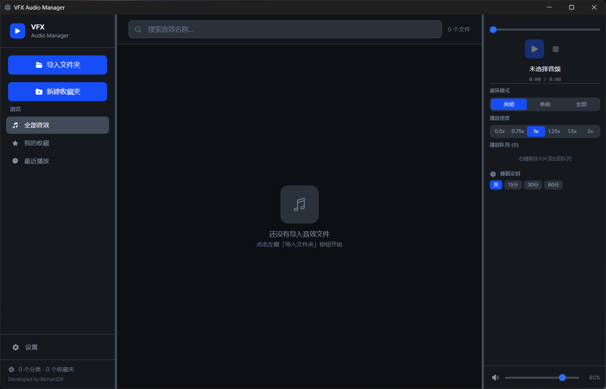

# VFX Audio Manager

> 现代化桌面音效管理软件 — 为视频剪辑创作者打造

[](LICENSE)
[](https://www.electronjs.org/)
[](https://react.dev/)

**VFX Audio Manager** 是一款基于 Electron + React 的本地音效素材库管理工具。帮助视频剪辑师、动画师和声音设计师高效地整理、搜索、试听和管理海量音效文件——就像音效界的 Lightroom。

---

## ✨ 功能特性

### 📁 文件夹导入与管理
- 一键导入本地文件夹作为「分类」（Category），自动递归扫描所有子目录
- 支持 **12 种音频格式**：MP3、WAV、FLAC、OGG、M4A、AAC、WMA、AIFF、OPUS、WEBM、MKA 等
- 自动读取音频元数据（时长、格式、文件大小）
- 支持**拖放导入**：直接将文件夹拖入窗口即可添加
- 分类可重命名、可移除，数据持久化到本地

### 🔍 浏览与搜索
- 按**全部**、**收藏**、**最近播放**、**分类**、**子目录**、**自定义合集**多维度浏览
- 实时关键词搜索，快速过滤目标音效
- 四种排序方式：名称 / 文件大小 / 时长 / 格式（升降序）

### ⭐ 收藏 & 自定义合集
- 一键标记收藏（Favorites），快速访问常用音效
- 创建**自定义合集**（User Collections），将不同分类的音效组织到同一个工作集合中
- 合集中的文件可随时添加或移除

### 🎵 音频播放器
- 内建播放器，点击即播
- 播放/暂停、停止、进度拖动
- 音量控制 & 静音切换
- 三种**循环模式**：关闭 / 单曲循环 / 列表循环
- **播放速率调节**：0.5x ~ 2.0x 变速播放
- **睡眠定时器**：可设定 5~60 分钟后自动停止播放
- **播放队列**：自由添加/移除/清空，支持跳到下一首

### ✅ 批量操作
- 多选模式：Ctrl/Shift + 点击多选，支持全选/反选
- 批量收藏 / 取消收藏
- 批量删除（从列表中移除）
- 批量添加到合集

### ⌨️ 键盘快捷键
| 快捷键 | 功能 |
|--------|------|
| `Space` | 播放 / 暂停 |
| `Escape` | 取消选择 / 停止播放 |
| `Delete` | 删除已选文件 |
| `Ctrl + A` | 全选当前列表 |
| `Ctrl + F` | 聚焦搜索框 |
| `←` / `→` | 快退 / 快进 5 秒 |
| `↑` / `↓` | 音量增大 / 减小 5% |
| `M` | 静音 / 取消静音 |
| `Ctrl + Q` | 加入播放队列 |

> 所有快捷键均可在设置中**自定义**

### 🎨 多主题
- **暗黑模式**（Dark）— 默认主题，护眼专业
- **明亮模式**（Light）
- **暖色模式**（Warm）
- **森林模式**（Forest）
- **海洋模式**（Ocean）

### 📌 其他亮点
- **最近播放**记录（最多 20 条）
- 可拖拽调整侧边栏和播放器面板宽度
- 文件右键菜单：在资源管理器中定位、复制路径
- 自定义文件显示名称（重命名不影响原文件）
- 所有数据本地持久化，无需联网

---

## 🖥️ 截图



---

## 🚀 快速开始

### 环境要求

- **Node.js** >= 18
- **npm** >= 9
- **Windows** 10/11（当前仅支持 Windows 打包；macOS/Linux 可自行构建）

### 安装与运行

```bash
# 1. 克隆仓库
git clone https://github.com/Kaleido05/vfx-audio-manager.git
cd vfx-audio-manager

# 2. 安装依赖
npm install

# 3. 启动开发模式（Vite + Electron 并行启动）
npm run dev

# 4. 构建生产版本
npm run build

# 5. 打包为 Windows 安装程序
npm run pack
```

### 项目脚本

| 命令 | 说明 |
|------|------|
| `npm run dev` | 启动 Vite 开发服务器 + Electron 窗口 |
| `npm run build` | 构建渲染进程 + Electron 主进程 |
| `npm run pack` | 打包为 NSIS Windows 安装程序（输出到 `release/`） |
| `npm run dist` | `build` + `pack` 一键完成 |
| `npm run typecheck` | TypeScript 类型检查 |

---

## 🏗️ 技术栈

| 层面 | 技术 |
|------|------|
| 桌面框架 | **Electron** 42 |
| 前端框架 | **React** 18 + TypeScript |
| 状态管理 | **Zustand** |
| UI 样式 | **Tailwind CSS** 3 |
| 图标库 | **react-icons** (Heroicons v2) |
| 音频元数据 | **music-metadata** |
| 构建工具 | **Vite** 5 + esbuild |
| 打包分发 | **electron-builder** (NSIS) |

---

## 📁 项目结构

```
vfx-audio-manager/
├── electron/                  # Electron 主进程
│   ├── main.ts                # 应用入口、窗口管理
│   ├── preload.ts             # 预加载脚本（contextBridge）
│   └── ipc/
│       ├── fileScanner.ts     # 文件夹扫描、音频元数据解析
│       └── storage.ts         # 数据持久化（JSON 文件）
├── src/                       # React 渲染进程
│   ├── main.tsx               # React 入口
│   ├── App.tsx                # 根组件（布局、拖放、初始化）
│   ├── components/
│   │   ├── Sidebar.tsx        # 侧边栏（分类/合集导航）
│   │   ├── AudioList.tsx      # 音效文件列表
│   │   ├── AudioCard.tsx      # 单个音效卡片
│   │   ├── AudioPlayer.tsx    # 音频播放器面板
│   │   ├── SearchBar.tsx      # 搜索栏
│   │   ├── BatchToolbar.tsx   # 批量操作工具栏
│   │   ├── SettingsPage.tsx   # 设置页面（主题/快捷键）
│   │   ├── CollectionPicker.tsx         # 合集选择器
│   │   └── CreateCollectionDialog.tsx   # 创建合集对话框
│   ├── store/
│   │   └── useStore.ts        # Zustand 全局状态 & 业务逻辑
│   ├── services/
│   │   └── AudioManager.ts    # HTML5 Audio 封装（单例）
│   ├── hooks/
│   │   └── useKeyboardShortcuts.ts  # 键盘快捷键 Hook
│   ├── types/
│   │   ├── index.ts           # TypeScript 类型定义
│   │   └── electron.d.ts      # Electron API 类型声明
│   └── styles/
│       └── index.css          # Tailwind CSS 入口 + 全局样式
├── scripts/
│   └── build-electron.mjs     # Electron 主进程构建脚本
├── electron-builder.yml       # electron-builder 打包配置
├── tailwind.config.js         # Tailwind CSS 配置（含主题色）
├── vite.config.ts             # Vite 配置
└── package.json
```

---

## 🔒 安全设计

- 启用 `contextIsolation`，渲染进程无法直接访问 Node.js API
- 禁用 `nodeIntegration`，所有系统能力通过 preload 脚本的 `contextBridge` 安全暴露
- 生产环境启用内容安全策略（CSP）

---

## 📄 License

MIT © [Kaleido05](https://github.com/Kaleido05)

---

## 🤝 贡献

欢迎提交 Issue 和 Pull Request！

1. Fork 本仓库
2. 创建你的功能分支 (`git checkout -b feature/amazing-feature`)
3. 提交你的修改 (`git commit -m 'Add some amazing feature'`)
4. 推送到分支 (`git push origin feature/amazing-feature`)
5. 打开一个 Pull Request
